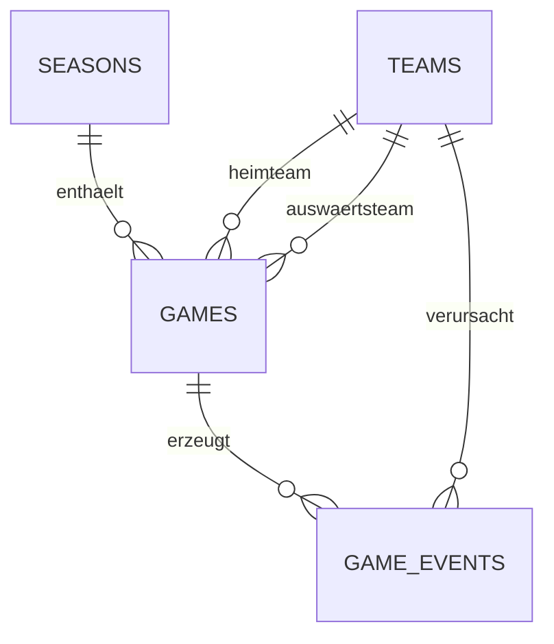

# Strat26

Strat26 ist ein vollständiges Turnierzentrum für acht Gruppen: Spielplan,
persistente Ergebnisse, reproduzierbare Spielsimulation, Ereignis-Timeline und
Live-Tabelle in einer responsiven Web-App.

## Funktionsumfang

- **Go-Backend** auf Basis der Standardbibliothek (`net/http`)
- **SQLite-Datenbank** mit Teams, Saison, Spielen und Spielereignissen
- automatische, verlustfreie Migration der bisherigen `games`-Tabelle
- kompletter Spielplan mit 16 Begegnungen in vier Spieltagen
- Simulation über ratingsensitive Poisson-Verteilungen
- reproduzierbare Resultate über einen optionalen Seed
- Tor- und Kartenereignisse je Spiel
- manuelle Ergebnisse und frei anlegbare Begegnungen
- Tabelle mit Punkten, Toren und Tordifferenz
- Dashboard mit Filtern, Detaildialogen, Dark/Light Theme und Offline-Fallback
- Healthcheck, Security-Header, Request-Limits und Graceful Shutdown

## Schnellstart

Voraussetzungen: Go 1.25 oder Docker.

```sh
go run .
```

Danach ist die App unter <http://localhost:8080> erreichbar. Beim ersten Start
werden `database/database.db`, das aktuelle Schema, acht Teams und die Saison
2026 automatisch angelegt.

Konfiguration:

| Variable | Standard | Bedeutung |
| --- | --- | --- |
| `PORT` | `8080` | HTTP-Port |
| `DATABASE_PATH` | `./database/database.db` | Pfad zur SQLite-Datei |

### Docker

```sh
docker compose up --build
```

Die Datenbank liegt dabei in einem benannten Volume und überlebt einen
Container-Neustart.

## Simulation

Jedes Team besitzt ein Rating. Aus Rating-Differenz und Heimvorteil berechnet
die Engine für beide Teams eine Torerwartung. Die Tore werden per
Poisson-Verteilung gezogen; dazu entsteht eine chronologisch sortierte
Timeline aus Toren und gelben Karten.

Ein identischer Seed erzeugt für dasselbe Spiel dasselbe Ergebnis und dieselbe
Timeline:

```sh
curl -X POST http://localhost:8080/api/games/1/simulate \
  -H 'Content-Type: application/json' \
  -d '{"seed":42}'
```

## REST-API

| Methode | Pfad | Zweck |
| --- | --- | --- |
| `GET` | `/api/health` | Datenbank-Healthcheck |
| `GET` | `/api/state` | kompletter Dashboard-Zustand |
| `GET` | `/api/teams` | Teams und Ratings |
| `GET` | `/api/seasons/current` | aktive Saison |
| `GET` | `/api/games` | Spiele; Filter `status` und `team` |
| `POST` | `/api/games` | Begegnung bzw. manuelles Ergebnis anlegen |
| `GET` | `/api/games/{id}` | Spiel inklusive Ereignissen |
| `PATCH` | `/api/games/{id}` | manuelles Ergebnis setzen |
| `DELETE` | `/api/games/{id}` | Spiel löschen |
| `POST` | `/api/games/{id}/simulate` | einzelnes Spiel simulieren |
| `POST` | `/api/schedule/generate` | Liga-Spielplan generieren |
| `POST` | `/api/simulate` | alle offenen Spiele simulieren |
| `GET` | `/api/standings` | aktuelle Tabelle |
| `POST` | `/api/reset` | alle Spiele der Demo-Saison entfernen |

Beispiele:

```sh
# Spielplan ab dem 1. August erzeugen
curl -X POST http://localhost:8080/api/schedule/generate \
  -H 'Content-Type: application/json' \
  -d '{"startAt":"2026-08-01T15:00:00Z","intervalDays":7}'

# Alle offenen Spiele reproduzierbar simulieren
curl -X POST http://localhost:8080/api/simulate \
  -H 'Content-Type: application/json' \
  -d '{"seed":2026}'

# Manuelles Ergebnis erfassen (alte home/away-Felder bleiben kompatibel)
curl -X POST http://localhost:8080/api/games \
  -H 'Content-Type: application/json' \
  -d '{"home":2,"away":6,"homeScore":3,"awayScore":1}'
```

## Datenmodell und Migration



Bestehende Installationen müssen nichts manuell migrieren: Erkennt der Start
das alte Schema mit `home`/`away`, wird die Tabelle innerhalb einer Transaktion
umgebaut und alle vorhandenen Resultate bleiben erhalten.

## Tests

```sh
go test ./...
go vet ./...
```

Die Tests decken Spielplan, Simulation und Seed-Reproduzierbarkeit, Tabelle,
Validierung, Security-Header sowie die Migration einer alten Datenbank ab.

## Statischer Betrieb

Wird nur `source/` ohne Go-Server ausgeliefert, wechselt das Frontend
automatisch in einen lokalen Offline-Modus. Spielplan, Simulation und Tabelle
funktionieren dann im Browser; die Daten werden in `localStorage` gespeichert.
