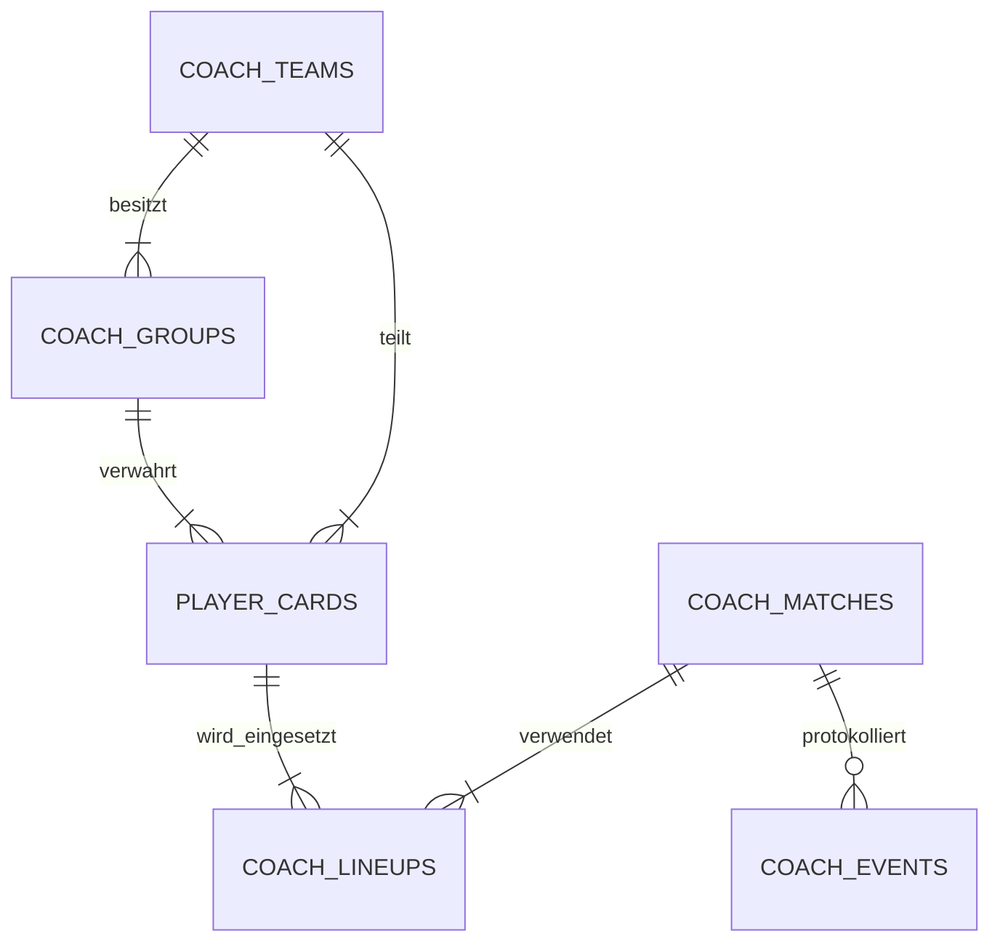

# Strategiespiel 2026 – Station Zentrale / Coach

Strat26 ist das digitale Charaktersheet der Station **Zentrale – Coach**. Die
Anwendung bildet nicht acht gegeneinander spielende Teams ab, sondern genau
die Mechanik des Strategiespiels:

- **zwei Fußballmannschaften**: Team Grün und Team Blau,
- **vier Untergruppen je Mannschaft**,
- **26 gemeinsame Spielerkarten je Mannschaft**,
- Kartenverantwortung und Abstimmung zwischen den vier Gruppen,
- Startelf, Bank und Auswechslungen,
- Aufwertung im Trainingscamp,
- stärkere, aber riskante Aufwertung durch Doping,
- Hymnen als Ressource, die durch Sponsoren gewonnen werden,
- Kontrollen von Gruppen und Spielerkarten durch die FIFA-Behörde,
- ein gemeinsames Fußballspiel mit Ereignisverlauf.

## Coach-Zentrale

Die Oberfläche ist auf die Aufgaben der Zentrale zugeschnitten:

1. **Zentrale** – Lagebild, Ressourcen, Gruppenverantwortung und Meldungen
2. **Spielerkarten** – alle 26 Karten eines Teams, Werte, Status und zuständige Gruppe
3. **Aufstellung** – elf Feldspieler, Bank und maximal fünf Wechsel im Spiel
4. **Aktionen** – Sponsoren, Trainingscamp, Doping und FIFA-Gruppenkontrollen
5. **Spielverlauf** – Ergebnis, Spielphase und vollständige Chronik

Zwischen Team Grün und Team Blau kann jederzeit umgeschaltet werden. Beide
Teams besitzen je einen eigenen Kader und Hymnenvorrat.

## Regelwerte

Da die Kurzbeschreibung keine konkreten Zahlen vorgibt, sind die technischen
Startwerte bewusst an einer Stelle in `models.go` gebündelt:

| Regel | Standard |
| --- | ---: |
| Feldspieler | 11 |
| maximale Wechsel im laufenden Spiel | 5 |
| Simulationsschritt | 5 Minuten |
| Sponsor-Ertrag | 4 Hymnen |
| Trainingscamp | 2 Hymnen, +2 auf einen gewählten Wert |
| Doping | 1 Hymne, +3 Angriff und Fitness |
| zusätzliches Dopingrisiko | +30 |
| Simulationsmodell | `possession-attack-finish-v2` |
| Angriffe je 5 Minuten | 1, zu 35 % ein zweiter Angriff |
| Ballbesitz-Korridor | 28–72 % |
| erfolgreiche Angriffsaufbauten | 35–78 % |
| Torwahrscheinlichkeit je Abschluss | 6–32 % |
| Heimvorteil im Ballbesitz | +2 Prozentpunkte |

Diese Zahlen sind keine Behauptung über das endgültige Regelheft. Sie sind
konfigurierbare Defaults, damit die Mechanik vollständig spielbar und später
ohne Umbau anpassbar ist.

## Mechanik

### Karten und Gruppen

Jede Mannschaft erhält beim ersten Start 26 Spielerkarten. Jede Karte gehört
dem gemeinsamen Teamkader, wird aber von genau einer der vier Untergruppen
verwahrt. Die Zentrale kann die Verantwortung innerhalb desselben Teams
übertragen. Eine Übergabe an eine Gruppe des Gegners verhindert das Backend.

### Training und Doping

Das Trainingscamp verbessert gezielt Angriff, Abwehr, Fitness oder Moral und
kostet Hymnen. Doping verbessert Angriff und Fitness stärker, erhöht aber den
verdeckten Dopingwert der Karte sowie die FIFA-Aufmerksamkeit der zuständigen
Gruppe.

Bei einer FIFA-Kontrolle werden alle Karten dieser Gruppe geprüft. Die
Entdeckungswahrscheinlichkeit steigt mit Dopingwert und Gruppenaufmerksamkeit.
Entdeckte Spieler werden gesperrt. War ein gesperrter Spieler auf dem Feld,
rückt automatisch eine geeignete, erlaubte Karte nach.

### Fußballspiel

Die Partie läuft in Schritten von fünf Minuten und wird vollständig im Backend
berechnet. Jeder Schritt durchläuft dieselbe nachvollziehbare Kette:

1. Aus den elf eingesetzten Karten entsteht ein Positionsprofil für Angriff,
   Mittelfeld, Abwehr, Torwart, Fitness und Moral.
2. Mittelfeld, Moral, Heimvorteil und Spielstand bestimmen den Ballbesitz.
3. Aus dem Ballbesitz entstehen ein oder zwei Angriffe.
4. Mittelfeld und Fitness entscheiden, ob der Angriffsaufbau zum Abschluss
   führt.
5. Angriff, gegnerische Abwehr, Torwart, Fitness und Moral entscheiden zwischen
   Tor, Parade und Fehlschuss.
6. Der Schütze wird nach Position, Angriff, Fitness, Moral und Einsatzzeit
   gewichtet ausgewählt.

Einsatzzeit erzeugt Ermüdung. Ein später eingewechselter Spieler ist deshalb
frischer als ein Spieler, der bereits 80 Minuten auf dem Feld steht. Ein
Rückstand erhöht besonders in der Schlussphase die Angriffslust, garantiert
aber kein Tor. Unpassende Formationen sowie ein fehlender Torwart erhalten
spürbare Positionsnachteile.

Zu jedem Fünf-Minuten-Intervall speichert die Chronik Ballbesitz, Angriffe und
Abschlüsse; Tore, Paraden und Fehlschüsse werden als eigene Ereignisse
protokolliert. Der Zufallsgenerator verwendet einen Seed. Identische Karten,
Aufstellungen, Aktionen und Seeds ergeben dadurch identische Partien.

Vor dem Anpfiff sind Aufstellungsänderungen frei; im laufenden Spiel werden
Wechsel bis zum konfigurierten Limit gezählt.

## Starten

Voraussetzungen: Go 1.25 oder Docker.

```sh
go run .
```

Die Anwendung läuft unter <http://localhost:8080>. Die SQLite-Datenbank wird
standardmäßig unter `database/database.db` angelegt.

```sh
docker compose up --build
```

| Variable | Standard | Bedeutung |
| --- | --- | --- |
| `PORT` | `8080` | HTTP-Port |
| `DATABASE_PATH` | `./database/database.db` | SQLite-Datei |

## REST-API

| Methode | Pfad | Zweck |
| --- | --- | --- |
| `GET` | `/api/health` | Backend- und Datenbankstatus |
| `GET` | `/api/state` | vollständiges Coach-Charaktersheet |
| `GET` | `/api/rules` | aktive technische Regelwerte |
| `POST` | `/api/actions/sponsor` | Hymnen durch Sponsor gewinnen |
| `POST` | `/api/actions/train` | Spielerwert im Trainingscamp erhöhen |
| `POST` | `/api/actions/dope` | riskante Spieleraufwertung |
| `POST` | `/api/actions/inspect` | FIFA-Kontrolle einer Gruppe |
| `PATCH` | `/api/players/{id}/group` | Kartenverantwortung übertragen |
| `POST` | `/api/match/substitute` | Aufstellung ändern / auswechseln |
| `POST` | `/api/match/advance` | Spiel um 5, 10 oder 15 Minuten fortsetzen |
| `POST` | `/api/reset` | Coach-Spielstand neu initialisieren |

Beispiele:

```sh
# Sponsor für Team Grün
curl -X POST localhost:8080/api/actions/sponsor \
  -H 'Content-Type: application/json' -d '{"teamId":1}'

# Angriff der Karte 4 im Trainingscamp erhöhen
curl -X POST localhost:8080/api/actions/train \
  -H 'Content-Type: application/json' \
  -d '{"teamId":1,"playerId":4,"focus":"attack"}'

# Karte 4 dopen
curl -X POST localhost:8080/api/actions/dope \
  -H 'Content-Type: application/json' -d '{"teamId":1,"playerId":4}'

# FIFA kontrolliert Gruppe 4 von Team Grün
curl -X POST localhost:8080/api/actions/inspect \
  -H 'Content-Type: application/json' -d '{"groupId":4}'
```

## Datenmodell



Die Tabellen der früheren Liga-Prototypen werden beim Start nicht zerstört.
Das Coach-Spiel nutzt eigene, klar benannte Tabellen (`coach_*` und
`player_cards`).

## Tests

```sh
go test -race ./...
go vet ./...
```

Abgedeckt sind Initialisierung der 52 Karten, Gruppenverantwortung, Sponsor-
und Hymnenlogik, Training, Doping und sichere FIFA-Entdeckung, automatische
Ersatzspieler, Wechselzählung, kompletter Matchverlauf, deterministische Seeds,
Simulationsprotokolle, Grenzwerte, Positionsprofile, Ermüdung, API-Validierung
und die nicht-destruktive Koexistenz mit älteren Datenbanktabellen.

> Die Mechanik ist serverseitig autoritativ. Ein rein statisches Deployment
> kann das Charaktersheet anzeigen, aber Aktionen und Persistenz benötigen das
> Go-Backend.
